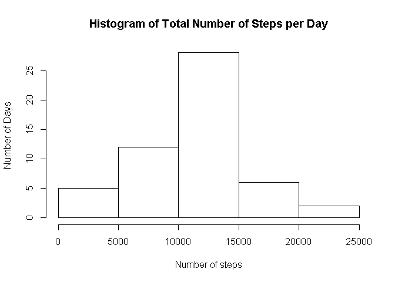
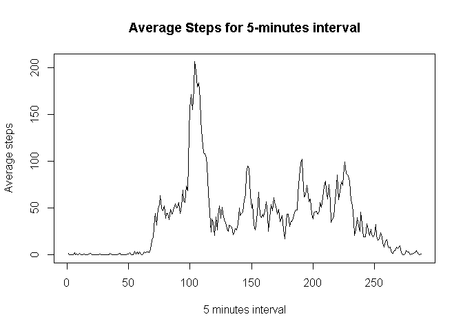
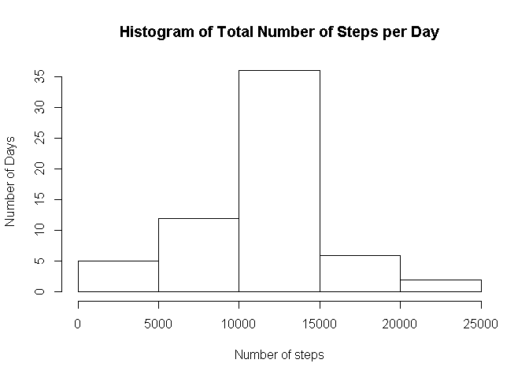
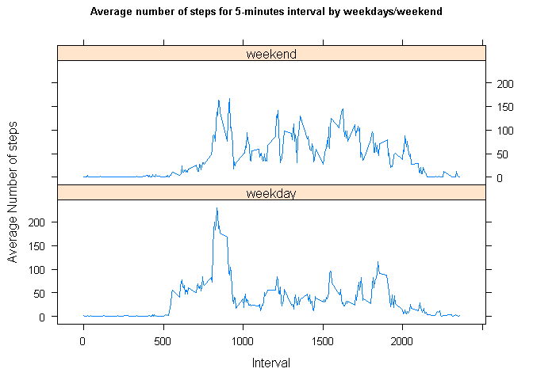

# Reproducible Research: Peer Assessment 1


## Loading and preprocessing the data


```r
#upload data and see a litle of it and if all obs are there
unzip("activity.zip")
data<-read.csv("activity.csv")
head(data)
str(data)

#configure format of date as date and see summary statistics
data$date<-as.Date(data$date)
str(data)
summary(data)

#remove NA from data
good<-complete.cases(data)
table(good) #to see how many NA´s are in data
#clean data without NA
cleandata<-data[good,]
```

## What is mean total number of steps taken per day?


For this part of the assignment, you can ignore the missing values in the dataset.

Starting to obtain the total number of steps taken per day and making a histogram of the total number of steps taken each day.


```r
library(dplyr)
```

```
## 
## Attaching package: 'dplyr'
## 
## The following object is masked from 'package:stats':
## 
##     filter
## 
## The following objects are masked from 'package:base':
## 
##     intersect, setdiff, setequal, union
```

```r
Dados<-tbl_df(cleandata)
Dados<-select(Dados, steps,date)
Gdados<-group_by(Dados, date)
totsteps<-summarize(Gdados, TotalSteps=sum(steps)) 
meants<-mean(totsteps$TotalSteps) #for the statistics measures to present later
medts<-median(totsteps$TotalSteps) #same reason
```


```r
with(totsteps, hist(TotalSteps,
main="Histogram of Total Number of Steps per Day", 
xlab="Number of steps", ylab="Number of Days"))
```

 

The mean and the median of total steps per day is 1.0766189\times 10^{4}and 10765, respectivly.


## What is the average daily activity pattern?


The time series plot (i.e. type = "l") of the 5-minute interval (x-axis) and the average number of steps taken, averaged across all days (y-axis) is provided bellow.


```r
Dados2<-tbl_df(cleandata)
Dados2<-select(Dados2, steps,interval)
Gdados2<-group_by(Dados2,interval)
sub<-summarize(Gdados2,mean=mean(steps))

with(sub,plot(mean,type="l", main="Average Steps for 5-minutes interval",
xlab="5 minutes interval", ylab="Average steps"))
```

 

Regarding the 5-minute interval, on average across all the days in the dataset, that contains the maximum number of steps:


```r
max<-as.numeric(select(filter(sub, mean==as.numeric(summarize(sub,max=max(mean)))),interval))
```
we obtain 835.


## Imputing missing values


```r
na<-as.numeric(table(good)[1])
```


The data has 2304 missing values. The approach used to fill them was using the round mean for that 5-minute interval.


```r
#get the round mean steps for each 5 min interval
sub2<-mutate(sub, interval, mean, roundsteps=round(mean,0))
sub2<-select(sub2,interval,roundsteps)
sub3<-as.data.frame(sub2)

#Working the missing values
for (i in 1:nrow(data)){
      if (is.na(data[i,1])){
  		      	data[i,1]<-sub3[sub3$interval==data[i,3],2]
			} 
}
newdata<-tbl_df(data)
```

The histogram of the total number of steps taken each day is provided bellow.


```r
newdata<-select(newdata,steps,date)
newdata<-group_by(newdata,date)
newd<-summarize(newdata,totalsteps=sum(steps))

with(newd,hist(totalsteps, main="Histogram of Total Number of Steps per Day", 
xlab="Number of steps", ylab="Number of Days"))
```

 

To obtain the mean and median total number of steps taken per day:


We obtain that the mean and the median are 1.0765639\times 10^{4} and 1.0762\times 10^{4}, respectively.

Comparing the estimates values with the previuos ones, they are similar. In this case and situation, the impact of the used approach was mimimal.


## Are there differences in activity patterns between weekdays and weekends?


```r
## obtain the weekdays and weekend
exd<-tbl_df(data)
ex1<-mutate(exd, days=format(as.Date(date),"%a"))

#transform the levels of the new factor variable
ex2<-mutate(ex1, days=gsub("seg","weekday",days),days=gsub("ter","weekday",days),
days=gsub("qua","weekday",days),days=gsub("qui","weekday",days),
days=gsub("sex","weekday",days),days=gsub("sáb","weekend",days),
days=gsub("dom","weekend",days) )

#obtain the statistics measures
ext<-select(ex2,steps,interval,days)
gext<-group_by(ext,days,interval)
dd<-summarize(gext,mean=mean(steps))

#making the time series plot
dd<-as.data.frame(dd)
library(lattice)
xyplot(mean~interval |factor(days), data=dd,layout=c(1,2),type="l",
main=list("Average number of steps for 5-minutes interval by weekdays/weekend",fontsize=8)
, xlab="Interval",
ylab="Average Number of steps")
```

 
